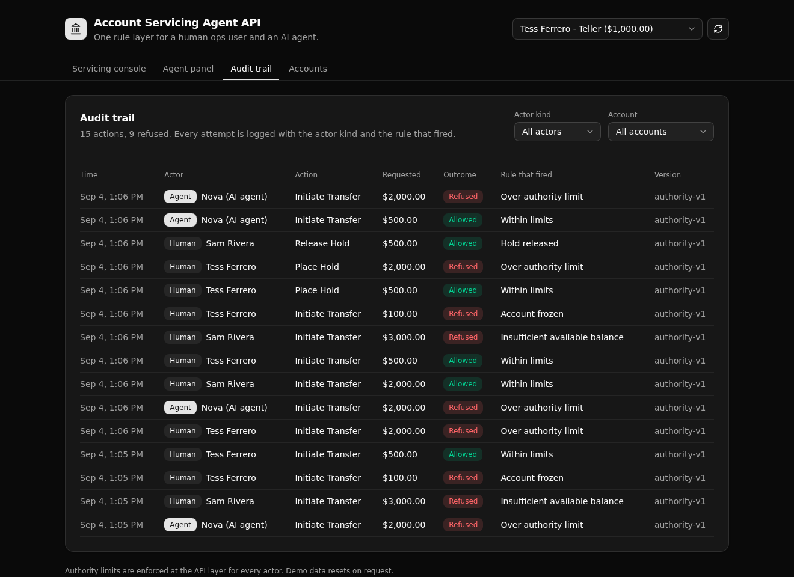

# Account Servicing Agent API

A governed banking servicing API where a human ops user and an AI agent call the same permissioned, audited endpoints. An over-limit transfer is refused the same way for a person and for the agent, and every attempt lands in one audit trail.



**Play 4 (Agent Intelligence Layer), banking.** 5 tables · 10 API endpoints · 1 rule function · 1 AI agent.

## What it demonstrates

An agent that can move customer money is only safe if it obeys the same limits a person does. This backend puts every money movement behind one rule layer. A human teller, a supervisor, and an AI agent all call the same endpoints, and each is held to the authority limit that rides on their own token.

The point a technical evaluator cares about: the rule lives in ONE place, not copied into each caller. When the agent asks to move more than its limit allows, it is refused by the exact same code path that refuses a person. A Director of AI, accountable for what agents may do to accounts, can read that one function and trust it.

Access is API-layer role-based access control (an auth table, minted tokens, and per-endpoint role checks). It is not row-level security.

## The one rule layer

Every transfer and hold runs through a single Xano function, `servicing_action`. It loads the actor, reads their authority limit, then checks three things in order:

1. the account must be active, or the attempt is refused as `account_frozen`
2. the amount must be within the actor's authority limit, or `over_authority_limit`
3. the amount must fit the available balance (balance minus holds), or `insufficient_available_balance`

On an allow it moves the money and writes a posted transaction. On a refuse it writes a refused transaction. Either way it writes one audit row with the actor kind, the outcome, and the rule that fired. The transfer endpoint, the hold endpoint, and the agent endpoint all call this same function, so a person and the agent are governed by identical code.

## Repo layout

```
account-servicing-agent-api/
├── xano/
│   ├── index.ts                       the workspace, registering everything below
│   ├── seed-data.ts                   the shared demo fixtures (one source of truth)
│   ├── tables/                        agents, customers, accounts, transactions, audit_actions
│   ├── functions/servicing-action.ts  the one rule layer both people and the agent call
│   ├── agents/servicing-agent.ts      the request parser (Xano's built-in model, no keys)
│   ├── api/                           groups, auth, servicing, audit, agent, admin endpoints
│   └── xano.lock                      pinned object identities (committed)
├── frontend/                          React, Vite, Tailwind, shadcn/ui
│   └── src/lib/api.ts                 paths and types derived from the query defs
└── docs/                              the landing page and the screenshot above
```

## API surface

| Verb | Path | What it enforces |
| --- | --- | --- |
| POST | `/api:asa_auth/login` | Authenticates an actor and mints a token that carries their role and authority limit. Same path for a human and an agent. |
| GET | `/api:asa_auth/actors` | Lists the actors for the demo picker. Never returns the password column. |
| GET | `/api:asa_servicing/accounts` | Lists accounts. Any authenticated actor. |
| GET | `/api:asa_servicing/account/{account_id}` | One account, with available balance computed on the server. |
| POST | `/api:asa_servicing/transfer` | Account status, then authority limit, then available balance, before it moves money. |
| POST | `/api:asa_servicing/hold` | The same checks. Reserves funds instead of sending them. |
| POST | `/api:asa_servicing/release-hold` | Supervisor role only, enforced with a precondition. |
| GET | `/api:asa_audit/actions` | The governance trail, newest first, filterable by account or actor kind. |
| POST | `/api:asa_agent/run` | Parses a plain-language request, then runs it through the same rule layer under the agent's own limit. |
| POST | `/api:asa_admin/seed` | Resets and seeds the demo so every screen is browsable. |

## Quick start

```bash
git clone https://github.com/xano-scratch/account-servicing-agent-api.git
cd account-servicing-agent-api
npm install
npx xanots login        # one-time browser sign-in to your Xano account
npm run xano:deploy     # deploys the backend and frontend, seeds data, prints the live URL
```

The deploy seeds a teller, a supervisor, and an AI agent, plus a few customers and accounts. Open the printed URL, pick an actor in the header, and run the same transfer as each one. Watch the rule layer treat a person and the agent the same way.

Every actor signs in with the shared demo password `servicing-demo`. It is demo data, not a secret.

## FAQ

**Where are the rules enforced?** In one function, `servicing_action`. The transfer, hold, and agent endpoints all call it, so there is a single place to read and audit.

**Is the agent really held to the same limit?** Yes. The agent endpoint only parses the request into a structured action. It then calls the same rule layer under the agent's own token, so the agent cannot move more than its authority limit any more than a person can.

**Does the agent need an external API key?** No. It uses Xano's built-in model, so the app runs on seed data with no credentials.

**Is this row-level security?** No. Access is API-layer role-based access control: an auth table, tokens minted by the login endpoint, and role checks on each endpoint.

**Is it a live production system?** No. It is a scratch proof artifact that runs on seed data. Deploy it to your own Xano account to try it.

## How it was built

The backend is authored in TypeScript with [`@xanots/sdk`](https://www.npmjs.com/package/@xanots/sdk): typed `table`, `apiGroup`, `query`, `defineFunction`, and `agent` objects registered on one workspace. The frontend derives its request paths and response types from those same query defs, so the client and server never drift. Run `npm run typecheck` and `npm run build` to check both.
